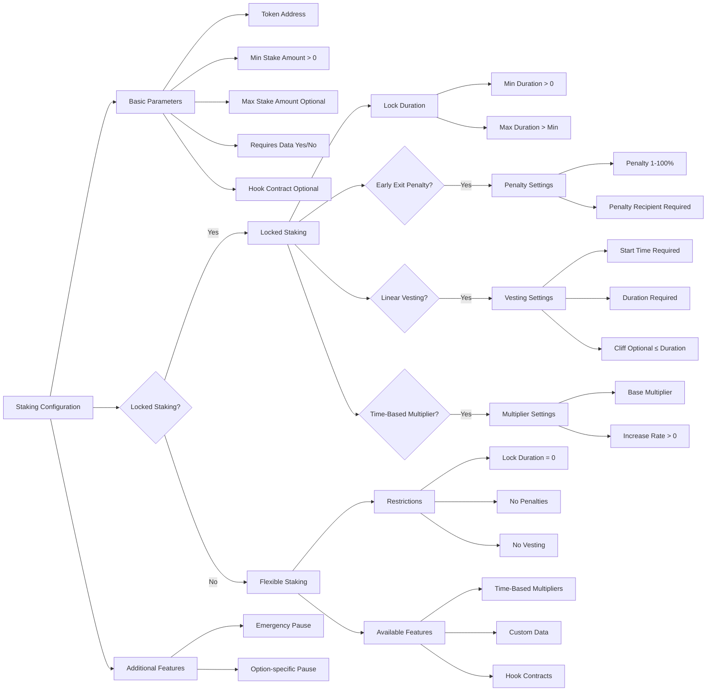

# FlexStake

FlexStake is a flexible staking contract that supports multiple staking options with various features including locking, vesting, penalties, and hooks.

## Features Overview

The contract allows creation of customizable staking options with the following features:

- Flexible or locked staking periods
- Linear vesting schedules
- Early exit penalties
- Time-based multipliers
- Custom data attachments
- Hook contracts for extended functionality
- Emergency pause mechanism
- Auto-renewal options
- Minimum and maximum stake amounts
- User-defined lock periods

## Staking Types

### 1. Flexible Staking
- No lock period required
- Stake and unstake at any time
- No penalties for withdrawal
- Supports custom data and hooks
- Optional time-based multipliers

### 2. Fixed-Term Staking
- Predefined lock periods
- Early withdrawal restrictions
- Configurable minimum and maximum amounts
- Optional features:
  - Early exit penalties (1-100%)
  - Linear vesting schedules
  - Time-based multipliers
  - Auto-renewal
  - Hook contracts

### 3. User-Defined Locking

- Customizable lock duration within bounds
- Min/max duration configurable
- Progressive rewards via multipliers
- Optional features:
  - Early exit penalties
  - Vesting schedules

### 4. Amount Configurations

- Fixed amount: Set specific stake amounts
- Flexible amount: Min/max range
- Per-option configuration

## Staking Options Tree

## Validation Rules

1. Basic Parameters:
   - Minimum stake amount must be greater than zero
   - Maximum stake amount must be greater than minimum (if set)
   - Token address must be valid ERC20

2. Locked Staking:
   - Minimum lock duration must be greater than zero
   - Maximum lock duration must be greater than minimum
   - Penalty percentage must be between 1-100%
   - Penalty recipient required if penalty enabled
   - Vesting requires locking to be enabled

3. Vesting:
   - Vesting duration must be greater than zero
   - Vesting start time must be set
   - Cliff period must be less than or equal to vesting duration
   - Only available with locked staking

4. Multipliers:
   - Base multiplier must be set if time-based multiplier enabled
   - Multiplier increase rate must be greater than zero if enabled
   - Available for both flexible and locked staking

5. Data Requirements:
   - If data is required, stake must include non-empty data
   - If data not required, stake must not include data

6. Flexible Staking Restrictions:
   - Cannot have lock periods
   - Cannot have penalties
   - Cannot have vesting
   - Can have multipliers and hooks
